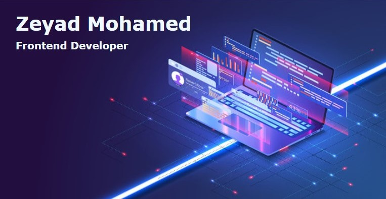

  
  
Welcome to my Profile!😄 I'm a Management Information System 📊 student at Alexandria University 🏫. I'm deeply passionate about coding 💻 & I actively upload my newest achievements🏆 Please check them out! 😁
  

 

<h1>Activities</h1>
  
  
  - 🔭 I’m currently working on <a href="https://www.frontendmentor.io/profile/ZeyadMohamed1805">Frontend Mentor</a> projects.
  - ⚡ I'm currently trying out different Frontend Frameworks.
  - 🌱 I’m currently learning Backend Development using Node.js 🧑‍

<h1>Goals</h1>

  

  

  
  -  I’m looking forward to get my first job as a Frontend Developer (My <a href="https://drive.google.com/file/d/1DBfkJarhIh6BaYJYDlQlQo0OENeNLdAh/view?  usp=share_link"> CV / Resume</a> & <a href="https://wuzzuf.net/me/Zeyad-Mohamed-0299ee3188">WUZZUF Profile</a>) 💼
  -  Deeply study other programming field (Android & IOS Development, Data Analysis, Cyber Security, etc.) 📖
  -  Gain Work Experience in multiple corporations. 🔝
  -  Sharing my knowledge with everyone who needs it. 👨‍🎓
  
  

<h1>Skills</h1>
  

  - HTML
  - CSS
  - Bootstrap
  - Javascript
  - React.js
  - Java

<h1>📫 Contact</h1>
  

  
📫Gmail: ZeyadMohamed.BUS.ACC@Gmail.com, 💼WUZZUF: https://wuzzuf.net/me/Zeyad-Mohamed-0299ee3188, 💻LinkedIn: Soon...

